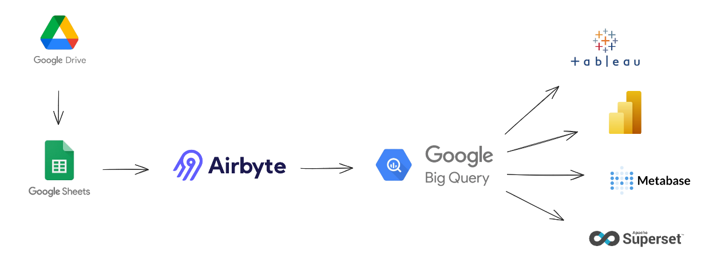
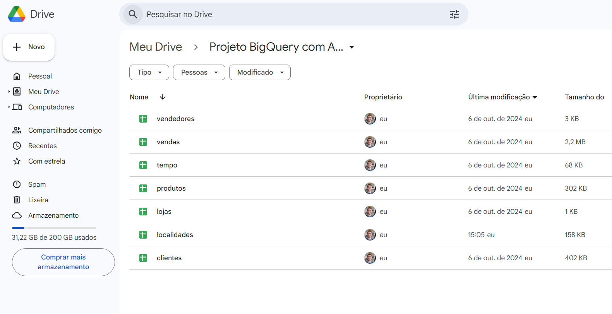
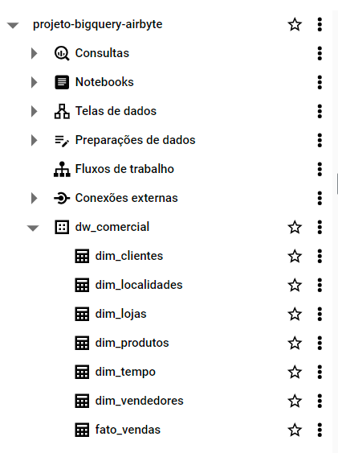
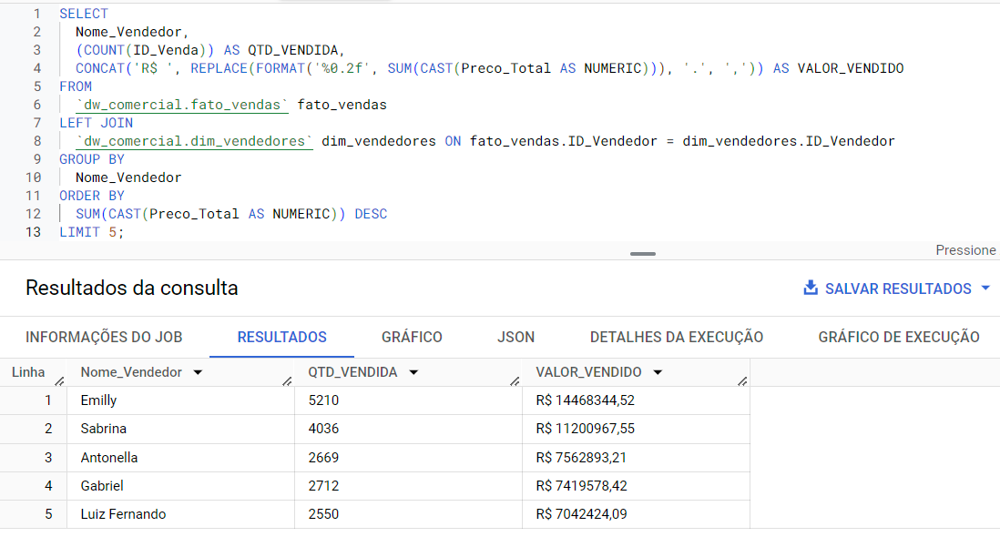
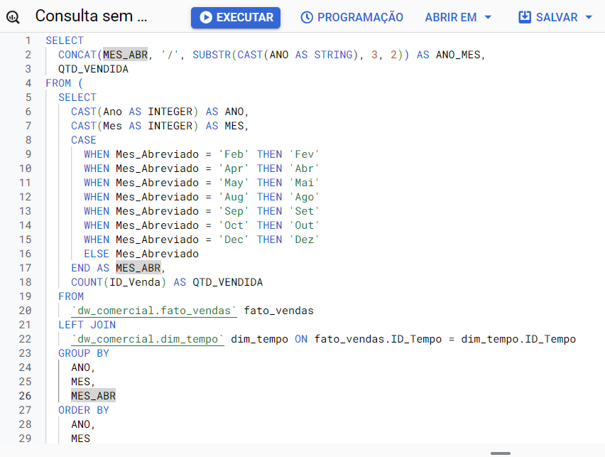
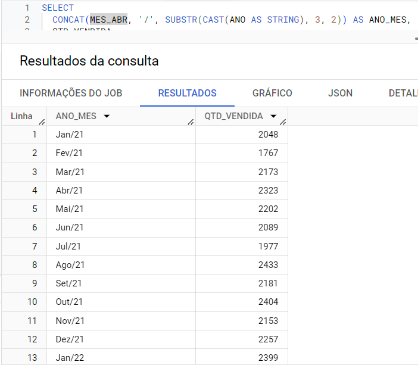
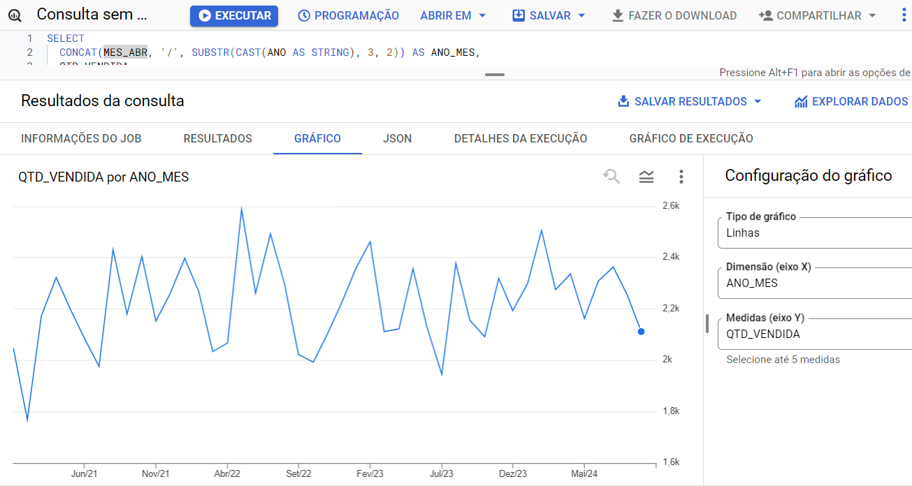

# Objetivo do Projeto

Este projeto foi desenvolvido a fim de colocar em prática e assimilar o conhecimento adquirido através da formação em Engenharia de Dados da Data Science Academy

<br>

# Descrição do Projeto

O projeto foi pensado na criação de uma arquitetura que funcionasse 100% na nuvem. Foi utilizado o Google Drive como um repositório de dados mais simples, o Airbyte Cloud para fazer toda a parte de integração e movimentação de dados e, por fim, o BigQuery como a plataforma a ser utilizada como banco de dados para suportar as análises de dados. A estrutura carregada no BigQuery foi a de um Data Warehouse (DW). Esse tipo de solução é bastante prática e fácil de ser implementada e pode ser viável e ideal para empresas que não possuem um banco de dados estrututado ou empresas ainda não maduras.

<br>

# Arquitetura do Projeto



<br>

# Tecnologias Utilizadas

- Google Drive
- Google Sheets
- Airbyte
- Google BigQuery
- Python
- SQL
- Git

<br>

# Exibição do Projeto

1. Planilhas do Google Sheets armazenadas no Google Drive



<br>

2. Configurações de Source, Destination e Connections no Airbyte


<br>

3. Integração de Dados com sucesso


<br>

4. Dados carregados nas tabelas já criadas no BigQuery com script Python

   

5. Com os dados carregados e preparados, entrou a parte de análise com consultas em SQL









<br>

# Instalação e Configuração

### Pré-requisitos

- Python 3.10;
- Git
- Necessário ter uma conta do Google para usar o Google Drive;
- Necessário ter uma conta no Airbyte Cloud (14 dias gratuitos);
- Necessário ter uma conta no GCP (Google Cloud Platform). Normalmente se tiver uma conta do Google já lhe dá acesso aos serviços do GCP (tome cuidado pois a maioria dos serviços são cobrados. Consulte a documentação.);
- É preciso criar uma conta de serviço no GCP. Você pode fazer isto clicando no menu lateral, indo em "IAM e administrador" e em seguida clicando em "Contas de serviço". Após criar esta conta de serviço faça o download do json que será disponibilizado. Ele permitirá que você consiga conectar o Python ao Google BigQuery;
- Além disso, será preciso criar um novo projeto no GCP e você pode fazer isto clicando em um componente logo ao lado da logo do Google Cloud e, posteriormente, em novo projeto. Criado o projeto, você precisará vincular uma conta de pagamento ao seu projeto, senão não será possível criar o banco de dados pelo Python.

<br>

### Passo a passo

1. Clone o repositório;

```
git clone "link do repositório"
```

2. Entre na pasta do projeto;

```
cd Projeto_Airbyte_Bigquery
```

3. Crie um ambiente virtual;

```
python -m venv venv
```

4. Ative o ambiente virtual;

```
CMD -> venv/Scripts/activate

PowerShell -> venv/Scripts/Activate.ps1
```

5. Instale os pacotes Python necessários;

```
pip install -r requirements.txt
```

6. Se já tiver configurado o GCP como informado acima, basta rodar o script Python para criar o banco de dados e as tabelas

```
python job_create_db_create_table.py
```

<br>

## Licença

Este projeto está licenciado sob os termos da licença MIT. Veja o arquivo [LICENSE](LICENSE) para mais detalhes.
